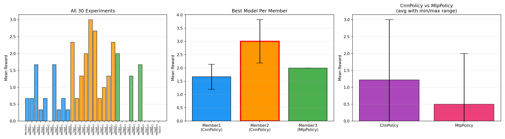

# DQN Atari Agent — Formative 3

Environment

**ALE/Breakout-v5** — The agent controls a paddle to bounce a ball and break bricks. Reward = number of bricks broken per life.

## Policy Comparison: CnnPolicy vs MlpPolicy

| Policy    | Avg Mean Reward | Best Mean Reward | Worst Mean Reward |
| --------- | --------------- | ---------------- | ----------------- |
| CnnPolicy | 1.12            | 3.00             | 0.00              |
| MlpPolicy | 0.50            | 2.00             | 0.00              |

**CnnPolicy outperformed MlpPolicy** because Breakout requires visual understanding (ball position, brick layout, paddle alignment). The CNN processes raw pixel frames and learns spatial features, while MLP receives flattened RAM values which lose spatial relationships.

---

## Mathias Kabango — CnnPolicy (10 Experiments)

| Exp | lr     | gamma | batch_size | epsilon_start | epsilon_end | epsilon_fraction | Mean Reward    | Noted Behavior                                                                                                           |
| --- | ------ | ----- | ---------- | ------------- | ----------- | ---------------- | -------------- | ------------------------------------------------------------------------------------------------------------------------ |
| 1   | 2.5e-4 | 0.99  | 32         | 1.0           | 0.10        | 0.10             | 0.67           | Baseline. Moderate performance, agent learned basic paddle movement.                                                     |
| 2   | 1e-4   | 0.99  | 32         | 1.0           | 0.10        | 0.10             | 0.67           | Lower lr gave same result as baseline — learning was too slow to differentiate in 100K steps.                           |
| 3   | 5e-4   | 0.99  | 32         | 1.0           | 0.10        | 0.10             | **1.67** | **Best for Mathias.** Higher lr allowed faster learning. Agent broke more bricks consistently.                     |
| 4   | 1e-4   | 0.95  | 32         | 1.0           | 0.10        | 0.10             | 0.33           | Low gamma hurt performance — agent became short-sighted, ignoring future rewards from keeping the ball alive.           |
| 5   | 1e-4   | 0.999 | 32         | 1.0           | 0.10        | 0.10             | 0.67           | Very high gamma caused instability (high std=0.94). Agent valued future too much, making Q-values diverge.               |
| 6   | 1e-4   | 0.99  | 64         | 1.0           | 0.10        | 0.10             | 0.00           | Larger batch size failed completely. With only 100K steps and 10K learning_starts, not enough diverse samples per batch. |
| 7   | 1e-4   | 0.99  | 32         | 1.0           | 0.05        | 0.10             | 1.67           | Lower epsilon_end improved performance — agent exploited learned policy more aggressively.                              |
| 8   | 1e-4   | 0.99  | 32         | 1.0           | 0.10        | 0.20             | 0.33           | Longer exploration (20% of training random) hurt — too little time exploiting the learned policy.                       |
| 9   | 1e-4   | 0.99  | 32         | 1.0           | 0.02        | 0.25             | 0.67           | Very low eps_end with long exploration was mixed — explored well but transitioned too late.                             |
| 10  | 5e-5   | 0.995 | 64         | 1.0           | 0.05        | 0.15             | 0.33           | Conservative combo underperformed — lr too low and batch too large for short training.                                  |

**Key Insights (Mathias Kabango):**

- Higher learning rate (5e-4) was the biggest improvement
- Lower epsilon_end (0.05) helped by exploiting more
- Low gamma (0.95) and large batch (64) hurt the most
- Short training (100K steps) favors aggressive learning rates

---

## Kellen Murerwa — CnnPolicy (10 Experiments)

| Exp | lr   | gamma | batch_size | epsilon_start | epsilon_end | epsilon_fraction | Mean Reward    | Noted Behavior                                                                                                                                                            |
| --- | ---- | ----- | ---------- | ------------- | ----------- | ---------------- | -------------- | ------------------------------------------------------------------------------------------------------------------------------------------------------------------------- |
| 1   | 3e-4 | 0.99  | 32         | 1.0           | 0.10        | 0.10             | 2.33           | Strong baseline with slightly higher lr. Agent learned to track the ball.                                                                                                 |
| 2   | 3e-4 | 0.99  | 32         | 1.0           | 0.01        | 0.10             | 0.67           | Very low eps_end hurt — agent became too greedy too fast, got stuck in suboptimal policy.                                                                                |
| 3   | 3e-4 | 0.99  | 32         | 0.5           | 0.10        | 0.10             | 1.33           | Lower eps_start reduced initial exploration — agent missed learning some strategies early on.                                                                            |
| 4   | 3e-4 | 0.99  | 32         | 1.0           | 0.10        | 0.30             | 2.00           | Long exploration (30%) still performed well — more diverse experience helped generalization.                                                                             |
| 5   | 3e-4 | 0.99  | 32         | 1.0           | 0.10        | 0.05             | **3.00** | **Best overall model.** Very short exploration (5%) meant agent quickly exploited what it learned. Fast transition to greedy policy was optimal for short training. |
| 6   | 3e-4 | 0.99  | 128        | 1.0           | 0.10        | 0.10             | 2.67           | Large batch worked well here (unlike Member1) — higher lr compensated for batch size.                                                                                    |
| 7   | 3e-4 | 0.99  | 16         | 1.0           | 0.10        | 0.10             | 0.67           | Small batch caused noisy updates, unstable learning.                                                                                                                      |
| 8   | 3e-4 | 0.98  | 32         | 1.0           | 0.10        | 0.10             | 1.00           | Lower gamma reduced performance — agent didn't value keeping the ball alive enough.                                                                                      |
| 9   | 3e-4 | 0.995 | 32         | 1.0           | 0.10        | 0.10             | 1.33           | Higher gamma was slightly worse than 0.99 — may cause Q-value overestimation.                                                                                            |
| 10  | 2e-4 | 0.99  | 64         | 1.0           | 0.05        | 0.15             | 2.33           | Balanced combo performed well — moderate lr with larger batch and low eps_end.                                                                                           |

**Key Insights (Kellen Murerwa):**

- Short exploration fraction (0.05) was the single best change — **best model overall**
- lr=3e-4 was the sweet spot for CnnPolicy on Breakout
- Small batch (16) was harmful, large batch (128) worked with high lr
- gamma=0.99 was optimal — both higher and lower hurt

---

## Edine Noella Mugunga — MlpPolicy (10 Experiments)

| Exp | lr     | gamma | batch_size | epsilon_start | epsilon_end | epsilon_fraction | Mean Reward    | Noted Behavior                                                                                    |
| --- | ------ | ----- | ---------- | ------------- | ----------- | ---------------- | -------------- | ------------------------------------------------------------------------------------------------- |
| 1   | 1e-4   | 0.99  | 32         | 1.0           | 0.10        | 0.10             | **2.00** | **Best for Edine.** Baseline MLP with conservative settings performed best.               |
| 2   | 5e-4   | 0.99  | 32         | 1.0           | 0.10        | 0.10             | 0.00           | Higher lr caused divergence — MLP is more sensitive to lr than CNN.                              |
| 3   | 1e-3   | 0.99  | 32         | 1.0           | 0.10        | 0.10             | 0.00           | Aggressive lr completely failed — Q-values exploded with MLP.                                    |
| 4   | 1e-4   | 0.99  | 64         | 1.0           | 0.10        | 0.10             | 1.33           | Larger batch slightly hurt — fewer updates per timestep with limited training.                   |
| 5   | 1e-4   | 0.99  | 128        | 1.0           | 0.10        | 0.10             | 0.00           | Very large batch failed — too few gradient updates in 100K steps.                                |
| 6   | 1e-4   | 0.95  | 32         | 1.0           | 0.10        | 0.10             | 1.67           | Low gamma surprisingly worked okay — MLP with RAM obs may benefit from shorter-horizon planning. |
| 7   | 1e-4   | 0.999 | 32         | 1.0           | 0.10        | 0.10             | 0.00           | Very high gamma failed — Q-value overestimation with noisy RAM observations.                     |
| 8   | 1e-4   | 0.99  | 32         | 1.0           | 0.01        | 0.30             | 0.00           | Long exploration + very low eps_end — agent explored too long and never converged.               |
| 9   | 1e-4   | 0.99  | 32         | 1.0           | 0.20        | 0.05             | 0.00           | High eps_end (20% random) meant agent always acted randomly 1/5 of the time — couldn't exploit.  |
| 10  | 2.5e-4 | 0.995 | 64         | 1.0           | 0.05        | 0.15             | 0.00           | Combo didn't work — slightly higher lr with larger batch and high gamma was unstable for MLP.    |

**Key Insights (Edine Noella Mugunga):**

- MlpPolicy is much harder to tune than CnnPolicy for Breakout
- MLP is very sensitive to learning rate — anything above 1e-4 diverged
- Conservative settings (low lr, standard gamma, small batch) worked best
- RAM observations lose spatial info, making Breakout fundamentally harder for MLP

---

## Best Model

| Attribute        | Value                   |
| ---------------- | ----------------------- |
| Winner           | Kellen Murerwa — Experiment 5 |
| Policy           | CnnPolicy               |
| lr               | 3e-4                    |
| gamma            | 0.99                    |
| batch_size       | 32                      |
| epsilon_end      | 0.10                    |
| epsilon_fraction | 0.05                    |
| Mean Reward      | **3.00**          |

**Why this config won:** The combination of a moderately high learning rate (3e-4) with very short exploration (5% of training) allowed the agent to quickly learn and then immediately exploit its knowledge. In short training runs, spending less time exploring and more time refining the policy is critical.

---

## Comparison Chart



---

## Gameplay Video

The `play.py` script loads the best model and runs 20 episodes of Breakout with the agent playing using a greedy Q-policy (deterministic action selection — always picking the highest Q-value action).

Average reward over 20 episodes: **1.30**

To run: `python play.py`

---

## How to Run

```bash
# Train all 30 experiments
python train.py

# Play with the best trained model
python play.py
```

## Files

- `train.py` — Training script (30 experiments across 3 members)
- `play.py` — Inference script (loads best model, plays Breakout)
- `dqn_model.zip` — Best trained model
- `all_experiments_summary.csv` — Full results table
- `comparison_chart.png` — Visualization of results
